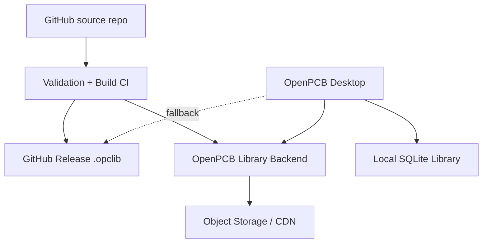
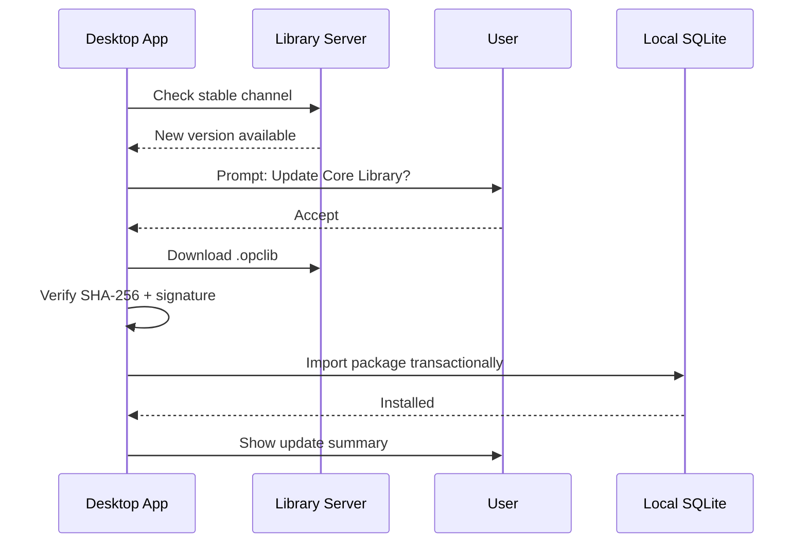
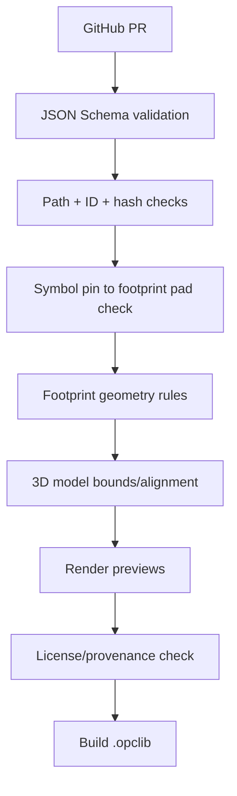

# Core Library v1 — draft specification

## 0. Working assumptions

Based on your answers, I would design the **OpenPCB Core Library** as:

* **Beginner-friendly**, but useful for real common boards.
* **Vendor-neutral** for v1.
* Includes **generic components + common real ICs/MCUs**.
* **Read-only** in the app.
* Users can **duplicate/fork** Core components.
* Shipped inside the desktop app as a **pre-synced snapshot**.
* Updates are available through **manual prompt**, not silent auto-sync.
* Sync supports **stable / beta / nightly** channels.
* Server source of truth is your backend, with **GitHub Releases as fallback**.
* Library source lives in GitHub as readable JSON.
* Release build packages everything into one signed Core Library package.
* Structure uses separate folders for **symbols**, **footprints**, **3D models**, and one top-level **`library.json`**.

This fits the current Library module well because the module is currently a flat catalog of `library_components`, `library_symbols`, and `library_footprints`, with built-ins protected by `is_builtin = 1`. 

---

# 1. Main design goal

## Core Library purpose

**OpenPCB Core Library** should be the “default useful parts set” that lets a new user build:

* LED/button/resistor/capacitor circuits.
* 555 timer circuits.
* USB-powered boards.
* Arduino-style boards.
* Small MCU boards.
* Sensor boards.
* Basic regulator/power boards.
* Simple op-amp circuits.
* ESP32/RP2040/ATmega-class boards.
* Boards ready for Gerber/BOM/PnP export.

It should **not** try to be KiCad-scale in v1.

Better v1 goal:

> **Small enough to review, big enough to build common boards.**

---

# 2. Recommended license

## Recommendation

Use:

> **CC-BY-SA 4.0 + OpenPCB Library Exception**

This is the safest option if you want to allow KiCad-derived or KiCad-inspired library data. KiCad’s libraries are licensed under **CC-BY-SA 4.0** with an exception that avoids forcing user electronic designs to inherit the library license. ([KiCad][1])

## Why not CC0?

CC0 is nice, but it becomes risky if any data is derived from:

* KiCad official libraries.
* Community libraries.
* Existing open symbol/footprint data.

## Suggested license text direction

Use something like:

```txt
OpenPCB Core Library is licensed under Creative Commons Attribution-ShareAlike 4.0 International.

OpenPCB Library Exception:
To the extent that electronic designs, manufacturing files, PCB layouts,
schematics, BOMs, pick-and-place files, or other generated design outputs
use data from the OpenPCB Core Library, those outputs are not considered
Adapted Material solely because they use this library data.
```

## Provenance rule

Every component should declare:

```json
{
  "provenance": {
    "source": "openpcb-original | kicad-derived | datasheet-derived | community",
    "license": "CC-BY-SA-4.0",
    "attribution": ["KiCad Library Contributors"],
    "notes": "Converted and normalized into OpenPCB native format."
  }
}
```

This protects future you.

---

# 3. Identity model

You asked if we can use both readable IDs and UUIDs.

**Yes. Use both.**

## Recommended identity fields

Each entity gets:

* **stable readable ID** — used in manifests, diffs, community PRs.
* **UUID** — internal immutable identity.
* **version** — semantic version.
* **content hash** — integrity and deduplication.

Example:

```json
{
  "id": "openpcb.core.passive.resistor",
  "uuid": "018f7f4c-6a9c-7a1d-b7d3-9bdb92f20100",
  "version": "1.0.0",
  "kind": "component"
}
```

## ID style

Use OpenPCB-style IDs, not KiCad-style names.

Good:

```txt
openpcb.core.passive.resistor
openpcb.core.passive.capacitor-polarized
openpcb.core.connector.usb-c-receptacle-usb2-smd-16p
openpcb.core.ic.timer.ne555
openpcb.core.mcu.rp2040
```

Avoid:

```txt
Device:R
Connector:USB_C_Receptacle_USB2.0
```

KiCad-style names are useful for import compatibility, but OpenPCB should have a cleaner native naming system.

---

# 4. Component versioning

## Version rules

Each component is versioned independently:

```txt
openpcb.core.ic.timer.ne555@1.0.0
openpcb.core.ic.timer.ne555@1.1.0
openpcb.core.ic.timer.ne555@2.0.0
```

## Semantic meaning

| Change type                                                                      | Version bump              |
| -------------------------------------------------------------------------------- | ------------------------- |
| Typo, description, tags                                                          | patch                     |
| Add footprint variant, add 3D model                                              | minor                     |
| Change pin mapping, symbol pins, footprint pad numbers, geometry breaking change | major                     |
| Mark obsolete / add replacement                                                  | patch or minor            |
| Remove component                                                                 | never hard-remove if used |

## Important rule

**Designs must not break after sync.**

Placed parts should keep their existing symbol/footprint snapshot. The Designer module already depends on library snapshots through the Library SDK flow. 

## Cleanup rule

You said:

> Keep old versions only if designs use them.

So desktop sync should support:

```txt
installed component version is unused + superseded + not pinned
→ safe to garbage collect
```

But this must only happen after checking local design references.

---

# 5. GitHub source layout

You requested:

* `symbols/`
* `footprints/`
* `3d/`
* one `library.json`
* avoid duplicate files
* no original source files
* readable and good for PRs

## Recommended repository structure

```txt
openpcb-core-library/
├── library.json
├── symbols/
│   ├── passive/
│   │   ├── resistor.symbol.json
│   │   ├── capacitor.symbol.json
│   │   ├── capacitor-polarized.symbol.json
│   │   ├── inductor.symbol.json
│   │   └── diode.symbol.json
│   ├── power/
│   ├── connector/
│   ├── ic/
│   └── mcu/
├── footprints/
│   ├── passive/
│   │   ├── r_0402.fp.json
│   │   ├── r_0603.fp.json
│   │   ├── r_0805.fp.json
│   │   ├── c_0603.fp.json
│   │   └── ...
│   ├── connector/
│   ├── package/
│   │   ├── sot-23-3.fp.json
│   │   ├── soic-8.fp.json
│   │   ├── qfn-32-5x5.fp.json
│   │   └── ...
│   └── mechanical/
├── 3d/
│   ├── passive/
│   │   ├── r_0603.glb
│   │   ├── r_0603.step
│   │   └── ...
│   ├── connector/
│   └── package/
├── parametric/
│   ├── templates/
│   │   ├── pin-header.template.json
│   │   ├── screw-terminal.template.json
│   │   ├── mounting-hole.template.json
│   │   └── qfn.template.json
│   └── presets/
├── previews/
│   ├── symbols/
│   ├── footprints/
│   └── components/
├── validation/
│   ├── rules.json
│   └── known-warnings.json
└── LICENSE.md
```

## Why this structure is good

* Easy GitHub PR review.
* Shared symbols/footprints are not duplicated.
* Multiple components can reference the same footprint.
* Parametric templates can live beside fixed components.
* Release pipeline can package everything into one sync artifact.

---

# 6. `library.json` format

## Top-level shape

```json
{
  "schemaVersion": "1.0.0",
  "library": {
    "id": "openpcb.core",
    "name": "OpenPCB Core Library",
    "channel": "stable",
    "version": "1.0.0",
    "license": "CC-BY-SA-4.0+OpenPCB-Library-Exception",
    "homepage": "https://openpcb.app/libraries/core",
    "generatedAt": "2026-05-17T00:00:00Z"
  },
  "symbols": [],
  "footprints": [],
  "models3d": [],
  "components": [],
  "templates": [],
  "deprecated": [],
  "integrity": {
    "algorithm": "sha256",
    "packageSha256": "..."
  },
  "signature": {
    "algorithm": "ed25519",
    "keyId": "openpcb-library-release-2026",
    "signature": "..."
  }
}
```

---

## Symbol entry

```json
{
  "id": "openpcb.core.symbol.passive.resistor",
  "uuid": "018f-symbol-resistor",
  "version": "1.0.0",
  "name": "Resistor Symbol",
  "path": "symbols/passive/resistor.symbol.json",
  "sha256": "...",
  "license": "CC-BY-SA-4.0+OpenPCB-Library-Exception"
}
```

---

## Footprint entry

```json
{
  "id": "openpcb.core.footprint.passive.r_0603",
  "uuid": "018f-footprint-r0603",
  "version": "1.0.0",
  "name": "R 0603",
  "path": "footprints/passive/r_0603.fp.json",
  "sha256": "...",
  "package": {
    "code": "0603",
    "mountType": "smd",
    "standard": "IPC-7351B"
  },
  "models3d": [
    "openpcb.core.3d.passive.r_0603"
  ]
}
```

---

## 3D model entry

```json
{
  "id": "openpcb.core.3d.passive.r_0603",
  "uuid": "018f-3d-r0603",
  "version": "1.0.0",
  "name": "0603 Passive Body",
  "formats": {
    "glb": {
      "path": "3d/passive/r_0603.glb",
      "sha256": "..."
    },
    "step": {
      "path": "3d/passive/r_0603.step",
      "sha256": "..."
    }
  },
  "boundsMm": {
    "x": 1.6,
    "y": 0.8,
    "z": 0.6
  }
}
```

---

## Component entry

```json
{
  "id": "openpcb.core.passive.resistor",
  "uuid": "018f-component-resistor",
  "version": "1.0.0",
  "name": "Resistor",
  "description": "Generic resistor with common SMD and THT footprint variants.",
  "category": "passive",
  "tags": ["resistor", "passive", "generic"],
  "symbol": "openpcb.core.symbol.passive.resistor",
  "defaultFootprint": "openpcb.core.footprint.passive.r_0603",
  "footprints": [
    "openpcb.core.footprint.passive.r_0402",
    "openpcb.core.footprint.passive.r_0603",
    "openpcb.core.footprint.passive.r_0805",
    "openpcb.core.footprint.passive.r_1206",
    "openpcb.core.footprint.passive.resistor_axial_0_25w"
  ],
  "parameters": {
    "value": {
      "type": "string",
      "default": "10k"
    },
    "tolerance": {
      "type": "string",
      "default": "1%"
    },
    "power": {
      "type": "string",
      "default": "0.1W"
    }
  },
  "pinMap": {
    "1": "1",
    "2": "2"
  },
  "provenance": {
    "source": "openpcb-original",
    "license": "CC-BY-SA-4.0+OpenPCB-Library-Exception",
    "attribution": []
  },
  "compatibility": {
    "minOpenPcbVersion": "0.1.0"
  }
}
```

---

# 7. Package format

## Release artifact

Each Core Library release should produce:

```txt
openpcb-core-library-1.0.0.opclib
```

Where `.opclib` is a ZIP file.

## Inside package

```txt
openpcb-core-library-1.0.0.opclib
├── library.json
├── symbols/
├── footprints/
├── 3d/
├── previews/
└── SIGNATURE.ed25519
```

## Integrity

Use:

* SHA-256 for each file.
* SHA-256 for package.
* Ed25519 signature for package or manifest.

You already requested **SHA-256** and signing. That is the right choice.

---

# 8. Library server specification

## Architecture



## Why backend + GitHub fallback

Your backend should be the normal path:

* channel metadata
* admin publishing
* update prompts
* telemetry later
* compatibility checks
* revoked releases
* CDN URLs

GitHub Releases should be fallback:

* if backend is down
* for transparency
* for community trust
* for reproducible release artifacts

GitHub release assets are suitable for this because GitHub exposes release asset download URLs and supports release assets with documented limits. ([GitHub Docs][2])

---

## API endpoints

### Get library channel info

```http
GET /api/libraries/core/channels/stable
```

Response:

```json
{
  "libraryId": "openpcb.core",
  "channel": "stable",
  "latestVersion": "1.0.0",
  "minimumOpenPcbVersion": "0.1.0",
  "release": {
    "version": "1.0.0",
    "manifestUrl": "https://openpcb.app/libraries/core/releases/1.0.0/library.json",
    "packageUrl": "https://cdn.openpcb.app/libraries/core/1.0.0/openpcb-core-library-1.0.0.opclib",
    "packageSha256": "...",
    "signatureUrl": "https://cdn.openpcb.app/libraries/core/1.0.0/SIGNATURE.ed25519",
    "githubFallbackUrl": "https://github.com/openpcb/core-library/releases/download/v1.0.0/openpcb-core-library-1.0.0.opclib"
  }
}
```

---

### Get installed-to-latest diff

```http
POST /api/libraries/core/diff
```

Request:

```json
{
  "installedVersion": "0.9.0",
  "installedComponents": [
    {
      "id": "openpcb.core.passive.resistor",
      "version": "1.0.0"
    }
  ],
  "channel": "stable",
  "openPcbVersion": "0.1.5-dev"
}
```

Response:

```json
{
  "updateAvailable": true,
  "from": "0.9.0",
  "to": "1.0.0",
  "summary": {
    "added": 42,
    "updated": 16,
    "deprecated": 3,
    "removedIfUnused": 2
  },
  "breakingChanges": [],
  "download": {
    "mode": "full-package",
    "packageUrl": "...",
    "packageSha256": "...",
    "signatureUrl": "..."
  }
}
```

---

### Get release manifest

```http
GET /api/libraries/core/releases/1.0.0
```

Response:

```json
{
  "libraryId": "openpcb.core",
  "version": "1.0.0",
  "channel": "stable",
  "packageSha256": "...",
  "signature": "...",
  "changelog": [
    "Added RP2040",
    "Added USB-C USB2 receptacle",
    "Added 0603/0805 passive footprints"
  ]
}
```

---

# 9. Sync behavior

## User-facing flow



## Important rules

* No silent auto-update.
* Show prompt with changelog.
* User can disable checks.
* User can switch channel.
* Sync must be transactional.
* Failed sync must not corrupt local library.
* Old versions are garbage-collected only when unused.

---

# 10. Desktop seeding strategy

## App installer includes

```txt
resources/core-library/openpcb-core-library-1.0.0.opclib
```

On first launch:

1. Check if `openpcb.core` exists locally.
2. If not, import bundled package.
3. Mark it as installed source:

```json
{
  "libraryId": "openpcb.core",
  "version": "1.0.0",
  "source": "bundled",
  "channel": "stable"
}
```

4. Later, user can sync to newer server version.

## Why this is better than old built-in seeding

Current built-ins are seeded directly in module code. 

For syncable Core Library, package import is better:

* same format for bundled and online library
* easier testing
* no hardcoded component data in TypeScript
* no app update needed for library updates

---

# 11. Required local DB changes

Current model is too flat for sync. It has components, symbols, footprints, and `is_builtin`. 

You need new metadata tables.

## Proposed tables

```txt
library_sources
library_releases
library_assets
library_component_versions
library_symbol_versions
library_footprint_versions
library_model3d_versions
library_usage_refs
library_sync_log
```

## Minimal table intent

### `library_sources`

Tracks installed libraries:

```txt
openpcb.core
user.local
team.my-company
```

### `library_releases`

Tracks installed release packages:

```txt
libraryId
version
channel
installedAt
packageSha256
signatureValid
source = bundled | sync | manual-import
```

### `library_component_versions`

Allows multiple versions of same component to exist.

```txt
componentId
version
uuid
symbolId
symbolVersion
defaultFootprintId
defaultFootprintVersion
metadataJson
isReadOnly
isDeprecated
replacementComponentId
```

### `library_usage_refs`

Needed for safe garbage collection.

```txt
designId
componentId
componentVersion
symbolId
symbolVersion
footprintId
footprintVersion
lastSeenAt
```

---

# 12. Read-only + duplicate behavior

Core components should be **immutable**.

User actions:

| Action                                 | Allowed?             |
| -------------------------------------- | -------------------- |
| Edit Core component directly           | No                   |
| Delete Core component if used          | No                   |
| Delete unused old Core version         | Yes, through cleanup |
| Duplicate Core component               | Yes                  |
| Fork Core component into local library | Yes                  |
| Override Core symbol globally          | No                   |
| Pin design to old version              | Yes                  |

Fork metadata:

```json
{
  "origin": {
    "libraryId": "openpcb.core",
    "componentId": "openpcb.core.ic.timer.ne555",
    "componentVersion": "1.0.0"
  }
}
```

---

# 13. Parametric templates in v1

You said **yes**, parametric components should come with first release.

This is very important because it avoids hundreds of duplicate entries.

## v1 parametric templates

Include these:

1. **Pin Header**

   * rows: 1–2
   * pins per row: 1–40
   * pitch: 2.54mm, 2.00mm, 1.27mm
   * THT/SMD
   * vertical/right-angle metadata

2. **Socket Header**

   * same as pin header
   * female symbol/footprint metadata

3. **Screw Terminal**

   * positions: 2–12
   * pitch: 3.5mm, 5.0mm, 5.08mm
   * THT

4. **Mounting Hole**

   * drill diameter
   * pad diameter
   * plated/non-plated
   * keepout option

5. **Test Point**

   * SMD round/rect
   * THT loop/pad

6. **Generic QFN**

   * pins
   * body size
   * pitch
   * exposed pad yes/no

7. **Generic QFP/TQFP/LQFP**

   * pins
   * body size
   * pitch

8. **Generic SOIC/TSSOP**

   * pins
   * pitch
   * body width

9. **Generic DIP**

   * pins
   * row spacing
   * pitch

This aligns with the project’s future parametric component direction, where pin headers, screw terminals, and mounting hole arrays were already identified as good v1 templates. 

---

# 14. First-release component scope

## Target boards for v1

I suggest Core Library v1 should support these example boards:

1. **LED blinker / 555 timer board**
2. **USB-C powered RP2040 board**
3. **ESP32 sensor board**
4. **Arduino-compatible ATmega328P board**
5. **CH340 USB-UART adapter**
6. **Basic buck/linear regulator board**
7. **Op-amp signal conditioning board**
8. **Relay/MOSFET driver board**
9. **I2C sensor breakout board**
10. **Small JLCPCB-style SMD board**, but vendor-neutral

---

# 15. Core Library v1 component list

## A. Generic passives

### Resistors

* Generic resistor symbol
* Resistor array symbol
* Potentiometer
* Trimmer potentiometer
* Photoresistor

Footprints:

* 0402
* 0603
* 0805
* 1206
* 1210
* 2010
* 2512
* Axial 0.25W
* Axial 0.5W
* THT vertical resistor

---

### Capacitors

* Non-polarized capacitor
* Polarized capacitor
* Electrolytic capacitor
* Variable capacitor

Footprints:

* 0402
* 0603
* 0805
* 1206
* 1210
* radial electrolytic 2.5mm pitch
* radial electrolytic 5.0mm pitch
* SMD electrolytic common sizes

---

### Inductors / ferrites

* Inductor
* Ferrite bead
* Common-mode choke

Footprints:

* 0603
* 0805
* 1206
* SMD power inductor 4x4
* SMD power inductor 6x6
* SMD power inductor 7x7
* THT radial inductor

---

## B. Diodes

Symbols:

* Diode
* Schottky diode
* Zener diode
* TVS diode
* LED
* RGB LED
* Bridge rectifier

Footprints:

* SOD-123
* SOD-323
* SMA
* SMB
* SMC
* DO-35
* DO-41
* LED 0603
* LED 0805
* LED 1206
* LED 3mm THT
* LED 5mm THT

---

## C. Transistors and MOSFETs

Symbols:

* NPN BJT
* PNP BJT
* N-MOSFET
* P-MOSFET
* N-MOSFET dual
* Logic-level N-MOSFET
* Darlington transistor

Packages:

* SOT-23-3
* SOT-223
* TO-92
* TO-220
* SOIC-8 MOSFET
* DFN-8 MOSFET

Example real parts:

* 2N3904
* 2N3906
* BC817
* BC807
* BSS138
* AO3400A
* IRLZ44N
* IRLZ34N

---

## D. Power

### Linear regulators

* AMS1117-3.3
* AMS1117-5.0
* AP2112K-3.3
* MCP1700-3.3
* LM7805
* LM1117 adjustable

Packages:

* SOT-223
* SOT-89
* SOT-23-5
* TO-220

### Switching regulators

* LM2596
* MP1584
* XL1509 / XL4015 class module footprint maybe later
* Generic buck regulator symbol
* Generic boost regulator symbol

### Power management support

* Fuse
* Polyfuse
* Reverse polarity diode
* TVS diode
* Power flag / power port symbols
* Battery cell
* Battery connector

---

## E. Connectors

### Generic connectors

Use parametric template for most:

* Pin header 1xN
* Pin header 2xN
* Female socket 1xN
* Female socket 2xN
* Screw terminal 2–12 pin
* Test point
* Mounting hole

### Fixed connectors

Include these manually:

* USB-C receptacle USB 2.0, 16-pin SMD
* Micro USB-B receptacle
* USB-A receptacle
* Barrel jack 5.5x2.1mm
* JST-PH 2-pin
* JST-PH 3-pin
* JST-XH 2-pin
* JST-XH 3-pin
* JST-SH/Qwiic/Stemma QT 4-pin
* IDC 2x3
* IDC 2x5
* SWD 1.27mm 2x5
* Tag-Connect 6-pin footprint
* SMA edge connector maybe v1.1

---

## F. Switches and user input

* Tactile switch 6x6mm THT
* Tactile switch SMD 4-pin
* Slide switch SPDT
* DIP switch 2/4/8 position
* Push button
* Rotary encoder basic
* Jumper solder bridge 2-pad / 3-pad

---

## G. Logic and interface ICs

### Basic logic

* 74HC00
* 74HC02
* 74HC04
* 74HC08
* 74HC14
* 74HC32
* 74HC74
* 74HC125
* 74HC245
* 74HC595
* 74HC165

Packages:

* DIP
* SOIC
* TSSOP where common

### Level shifting

* BSS138 level shifter circuit component/block later
* TXS0108E
* TXB0108
* 74LVC245

---

## H. Timers and analog

* NE555 / LM555
* LM358
* LM324
* TL072
* MCP6001
* MCP6002
* LM393 comparator
* LMV331 comparator
* TL431 reference

Packages:

* DIP-8
* SOIC-8
* TSSOP-8
* SOT-23-5 where useful

---

## I. MCUs

For v1, include a focused set.

### AVR

* ATmega328P-AU
* ATmega328P-PU
* ATtiny85
* ATtiny13 maybe optional

### RP2040

* RP2040 QFN-56
* W25Qxx flash support component
* Crystal 12MHz
* USB-C support components

### STM32

Start small:

* STM32F103C8T6
* STM32F030F4P6
* STM32G030F6P6

### ESP

Be careful here because modules are easier than bare ESP chips.

* ESP32-WROOM-32 module
* ESP32-C3-MINI module
* ESP-12F module

I would prioritize **modules** over bare ESP32 ICs in v1 because beginner boards are easier and safer.

---

## J. USB / serial / communication

* CH340C
* CH340G
* CP2102N
* FT232RL maybe optional
* USBLC6-2SC6 ESD protection
* TUSB-style parts later, not v1

Communication ICs:

* MAX485 / SP3485 RS-485
* MCP2515 CAN controller
* SN65HVD230 CAN transceiver
* PCA9306 I2C level translator
* TCA9548A I2C mux

---

## K. Sensors and common modules

For v1, include common breakout-friendly ICs and modules:

* BME280
* BMP280
* MPU6050
* LIS3DH
* DS18B20
* NTC thermistor
* HC-SR04 header footprint
* Generic I2C sensor 4-pin connector
* Generic Qwiic/Stemma QT connector

Maybe do real sensor ICs in v1.1 if symbol/footprint validation becomes heavy.

---

## L. Crystals / oscillators

* 2-pin crystal
* 4-pin oscillator
* 32.768 kHz crystal
* 12 MHz crystal
* 16 MHz crystal

Footprints:

* HC49 THT
* SMD 3225
* SMD 5032
* SMD 7050
* tuning fork crystal SMD

---

## M. Mechanical

* Mounting hole NPTH
* Mounting hole PTH
* M2 / M2.5 / M3
* Fiducial
* Tooling hole
* Board edge marker
* Test pad

---

# 16. Suggested v1 release size

I would target roughly:

| Type                 |   Count |
| -------------------- | ------: |
| Symbols              | 120–180 |
| Footprints           | 250–400 |
| 3D models            | 150–250 |
| Components           | 180–300 |
| Parametric templates |    8–10 |

This is enough to feel useful without becoming impossible to review.

---

# 17. Validation pipeline

Every PR should run validation.

## Required checks



## Validation rules

Each component must pass:

* JSON schema valid.
* Stable ID format valid.
* No duplicate UUIDs.
* Symbol pin numbers unique.
* Footprint pad numbers unique.
* Pin map complete.
* Default footprint exists.
* All referenced files exist.
* SHA-256 hashes match.
* 3D model exists if required.
* 3D model roughly aligns with footprint courtyard.
* Package has license/provenance.
* Deprecated component has replacement if possible.

## Review artifacts

CI should generate:

* symbol preview PNG
* footprint preview PNG
* 3D preview PNG
* validation report JSON
* package preview changelog

---

# 18. Release process

## GitHub workflow


## Channels

Use:

* **stable** — normal users.
* **beta** — release candidates.
* **nightly** — latest main branch package.

## Promotion model

```txt
nightly → beta → stable
```

Stable should only update after:

* validation passes
* previews generated
* manual admin approval
* package signed

---

# 19. Backend release admin model

Admins should be able to:

* upload `.opclib`
* verify package
* publish to beta
* promote beta to stable
* revoke a broken release
* add release notes
* see install stats later
* see validation report

Community contributors only use GitHub PRs.

---

# 20. Delta updates

You were unsure about delta updates.

## Recommendation for v1

Do **not** implement binary delta updates yet.

Use:

* full package download
* manifest comparison
* local import only changed files internally

The package may contain everything, but the app can import only changed assets by comparing SHA-256.

This is much simpler and reliable.

## Later v2

Add optional delta packages:

```txt
openpcb-core-library-1.0.0-to-1.1.0.opclibdelta
```

Not needed for first release.

---

# 21. Import algorithm in desktop app

```txt
1. Download package
2. Verify package SHA-256
3. Verify Ed25519 signature
4. Unzip to temp folder
5. Validate library.json
6. Validate all referenced files
7. Begin SQLite transaction
8. Import symbols
9. Import footprints
10. Import 3D models
11. Import components
12. Mark release installed
13. Compute unused old versions
14. Garbage collect safe unused old versions
15. Commit transaction
16. Refresh Library UI
```

If any step fails:

```txt
rollback transaction
delete temp folder
show error
```

---

# 22. Best naming option

Use friendly UI names and stable technical IDs.

## UI name

```txt
USB-C Receptacle, USB 2.0, 16-pin SMD
```

## Stable ID

```txt
openpcb.core.connector.usb-c-receptacle-usb2-smd-16p
```

## Search aliases

```json
{
  "aliases": [
    "USB Type-C",
    "USB-C 16P",
    "USB 2.0 Type-C receptacle"
  ]
}
```

## MPNs optional for v1

Since vendor integration is separate, include MPNs only where they are identity-critical.

Example:

```json
{
  "manufacturerParts": [
    {
      "manufacturer": "WCH",
      "mpn": "CH340C"
    }
  ]
}
```

Do not include distributor SKUs yet.

---

# 23. Recommended first milestone plan

## Milestone 1 — format

* Define `library.json` schema.
* Define symbol JSON schema.
* Define footprint JSON schema.
* Define 3D model metadata schema.
* Define component JSON schema.
* Add validator CLI.

## Milestone 2 — package import

* Build `.opclib` importer.
* Replace hardcoded built-in seed with bundled package import.
* Add read-only Core source.
* Add duplicate/fork behavior.

## Milestone 3 — sync

* Add backend channel endpoints.
* Add update check UI.
* Add download + verify + import.
* Add GitHub fallback URL.

## Milestone 4 — content v1

* Build parametric templates.
* Add passives/connectors/packages.
* Add common ICs/MCUs.
* Generate previews.
* Validate all pin maps.

## Milestone 5 — public launch

* Publish `openpcb.app/libraries/core`.
* Publish GitHub repo.
* Add contribution guide.
* Add validation badges.
* Add changelog page.

---

# 24. My strongest recommendations

## Keep v1 curated

Do not start with thousands of components.

Start with:

* strong passives
* strong connectors
* strong footprints
* strong power basics
* 10–20 real ICs
* 5–8 MCUs/modules
* parametric generators

## Make Core Library boring and reliable

For EDA, bad libraries are dangerous.

A small correct library is better than a huge questionable one.

## Treat library data as release artifacts

Do not seed Core Library from TypeScript long-term.

Use:

```txt
GitHub readable source → CI build → signed .opclib → bundled + syncable
```

## Build provenance now

Even if v1 is mostly original, add provenance fields immediately.

It will save you later.

---

# 25. Draft decision summary

```txt
Core Library ID: openpcb.core
Format: OpenPCB-native JSON
Source: GitHub repo
Release artifact: signed .opclib ZIP
Server: OpenPCB backend API
Fallback: GitHub Releases
Sync: user-prompted, not automatic
Channels: stable / beta / nightly
Bundled with app: yes
3D models: yes, STEP + GLB preferred
License: CC-BY-SA 4.0 + OpenPCB Library Exception
Components: generic + common real ICs/MCUs
Vendor data: no distributor integration in v1
Editing: read-only; duplicate/fork required
Versioning: immutable component versions
Cleanup: remove old unused versions only
Validation: required in CI before release
```

This is a strong foundation for a public, syncable Core Library.

[1]: https://www.kicad.org/libraries/license/?utm_source=chatgpt.com "Libraries License"
[2]: https://docs.github.com/en/rest/releases/assets?utm_source=chatgpt.com "REST API endpoints for release assets"
